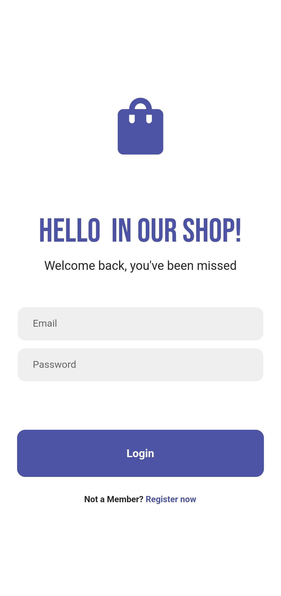
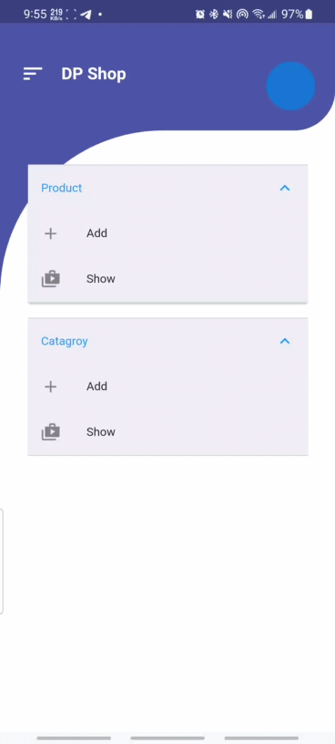

## e-store App with Tow option to User and Admin Screen

## Introduction

    The application about e-stor app contain tow rules one for the user and for Admin . 
    Admin can add Category of product and the add product with image .
    and use can browse product and add it to cart .
    I use in this app Http package to connect app with DataBase using API .

we use Multi tool in this app like:
1. MySql 
2. PHP for Make API
3. Http Package in flutter

___

# Here is Some Image about 

___
## register and Login screen  

___

## Home page for Admin

## Add Category Screen

## Add Product Screen

## Show Product Screen

## Home page for User

## product page for User

## Cart page for User

## Conclusion
    I build his app when I was learn dealing with API in Flutter I hope was great and I try to do my best and I hope to learn more .
    In last I hope this code helpful to author and if anyone have some advice for me you can send it through this email : mohammed715332@gmail.com.
    Thank you.